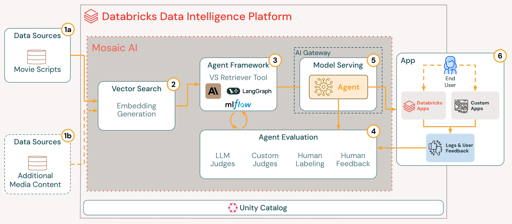

# Contextual Advertising

This repository provides a code base for building a Retrieval-Augmented Generation (RAG) agent on Databricks that can recommend optimal ad placement locations in movies based on user inquiries. The solution can be applied more broadly to contextual advertising use cases for any large corpus of media content (e.g., TV scripts, news articles, blogs, social media posts, etc.)

## 🎯 Project Overview

The contextual advertising agent is an AI-powered system that leverages Mosaic AI on Databricks to understand movie scripts and identify the best moments to insert advertising content.

### Architecture



**1. Data Sources:** Movie scripts or media content stored in cloud storage or external systems
- This code leverages a public dataset of movie scripts for ad placement
- The solution can be generalized to work for other content, including TV scripts, blogs, news articles, audio/podcast transcripts, or other media content  

**2. Data Preprocessing:** Unstructured text is ingested, parsed, cleansed, and chunked. We then create embeddings from the processed text chunks and index them in a Databricks Vector Store.

**3. Agent Development:** Ad Placement agent leverages vector search retriever tool, LangGraph, MLflow, and LLM of choice (in this example we use a Claude model)

**4. Agent Evaluation:** Agent quality continuously improves through LLM judges, custom judges, human feedback, and iterative development loop

**5. Agent Deployment:** Agent Framework deploys agent to a Databricks model serving endpoint, governed, secured, and monitored through AI Gateway 

**6. App Usage:** Exposes Agent to end users through Databricks Apps or custom app; log all user feedback and logs back to Databricks for continuous quality improvement

## 📁 Project Structure

```
ad-placement-agent/
├── 00_Movie_Dataset_Creation.ipynb    # Script scraping and dataset creation
├── 01a_Data_Preparation.ipynb         # Data preprocessing and cleaning
├── 01b_Data_Preparation_Images.ipynb  # Image processing for movie posters
├── 02_Agent_Definition.ipynb          # RAG agent definition and configuration
├── 03_Agent_Evaluation.ipynb          # Agent evaluation and deployment
├── requirements.txt                   # Centralized dependency management
├── .gitignore                         # Git ignore patterns
├── LICENSE                            # Project license
├── images/
│   └── ad-placement-architecture.png  # System architecture diagram
├── resources/
│   ├── 00-init.ipynb                  # Initialization notebook
│   └── config                         # Configuration file
├── app/                               # Databricks Apps files 
└── mcp/                               # Model Context Protocol server implementation
```

## 🔧 Installation & Setup

1. **Clone the repository**:
   ```bash
   git clone <repository-url>
   cd ad-placement-agent
   ```

2. **Install dependencies**:
   ```bash
   pip install -r requirements.txt
   ```

3. **Configure Databricks**:
   - Set up Unity Catalog with catalog: `movie_scripts`
   - Create schema: `ad_placement_agent`
   - Configure Vector Search endpoint
   - Set up MLflow tracking

## 📖 Usage

### 1. Dataset Creation
Run `00_Movie_Dataset_Creation.ipynb` to:
- Fetch all movie scripts from IMSDb
- Extract metadata (title, genre, rating, etc.)
- Store data in Unity Catalog tables

### 2. Data Preparation
Execute the data preparation notebooks:
- `01a_Data_Preparation.ipynb`: Process, clean, and chunk script data to build Vector Search Index
- `01b_Data_Preparation_Images.ipynb`: Generate and index embeddings from movie posters

### 3. Agent Definition
Use `02_Agent_Definition.ipynb` to:
- Define the RAG agent with vector search retrieval tool
- Test agent with example prompt

### 4. Evaluation & Deployment
Run `03_Agent_Evaluation.ipynb` to:
- Log the agent with MLflow
- Register agent to Unity Catalog
- Deploy agent using [Agent Framework](https://docs.databricks.com/aws/en/generative-ai/agent-framework/author-agent)
- Perform automated and human evaluations using MLflow 3.0 and [Agent Evaluation](https://docs.databricks.com/aws/en/mlflow3/genai/eval-monitor/)

## 🎬 Example
Once the agent is deployed, query the endpoint with a description of the advertisement you would like to place. Example below:

```python
# Example query to the deployed agent
query = "When could I insert a commercial for a light-hearted basketball-themed comedy movie we want to promote for next summer?"

# The agent will analyze movie scripts and return recommendations
# based on scene context, genre, and timing
```

TODO: add screenshot


## 🤝 Contributing

1. Fork the repository
2. Create a feature branch
3. Make your changes
4. Add tests if applicable
5. Submit a pull request

## 📄 License

This project is licensed under the terms of the [Apache 2.0 License](LICENSE).